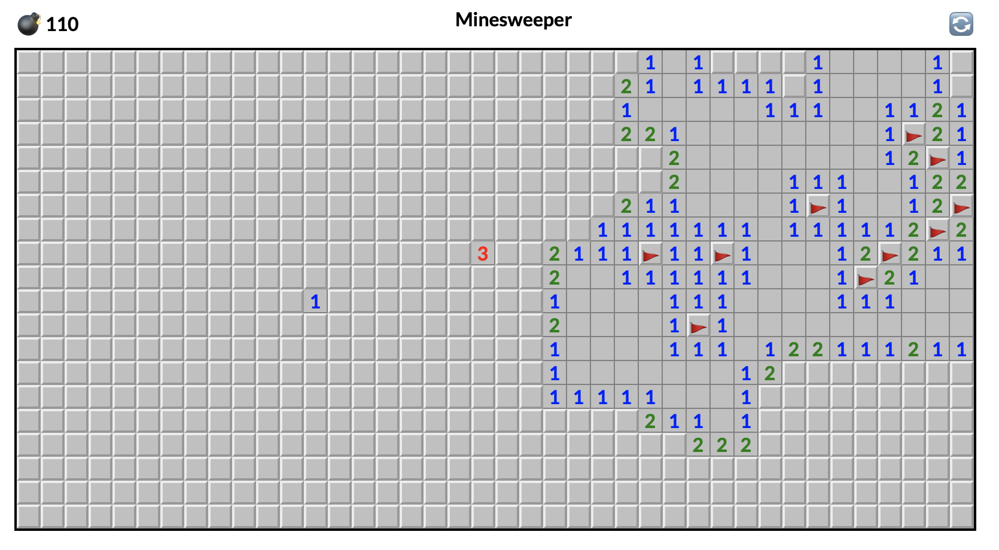

# minesweeper

Simple JS minesweeper game.

Check out here: https://kyczan.github.io/minesweeper/

It is just weekend project - for fun - as I wanted to play minesweeper.

To run locally: clone repo, `npm i` and `npm run dev`.

